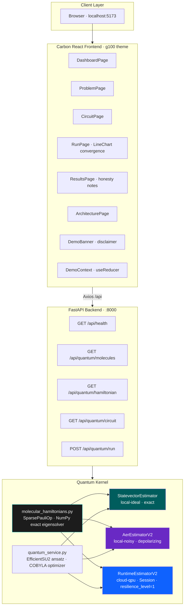

# Architecture — Quantum Molecular Simulator

## Solution Summary

A full-stack IBM Qiskit demo application that executes VQE (Variational Quantum Eigensolver) for molecular ground-state energy calculation. The quantum kernel runs on three backends: exact local, noisy local, and real IBM Quantum hardware. The Carbon React g100 frontend visualises the optimization convergence and compares VQE results against the classical exact eigensolver.

---

## System Architecture



---

## Data Flow

1. **User selects** molecule (H2/LiH/H2O) + bond length + backend mode in `RunPage`
2. **POST /api/quantum/run** dispatches to `quantum_service.run_vqe()`
3. **`build_hamiltonian()`** constructs `SparsePauliOp` from illustrative STO-3G coefficients
4. **`exact_ground_state_energy()`** diagonalises the 4×4 matrix → exact reference energy
5. **Ansatz**: `EfficientSU2(n_qubits=2, reps=1)` → 6 trainable parameters
6. **Transpile**: `generate_preset_pass_manager(optimization_level=1, backend=…).run(ansatz)` → ISA circuit
7. **`apply_layout`** aligns the SparsePauliOp to the ISA circuit's physical qubits
8. **Estimator V2 PUB**: `(isa_ansatz, [isa_hamiltonian], params)` → `⟨ψ(θ)|H|ψ(θ)⟩`
9. **COBYLA** minimises expectation value iteratively
10. Response includes `energy_history`, `final_energy`, `exact_energy`, `error_vs_exact`
11. Frontend plots convergence with `@carbon/charts-react LineChart`

---

## Component Inventory

| Layer | Component | Version / Notes |
|-------|-----------|-----------------|
| Frontend | React | 18.3 |
| Frontend | @carbon/react | v11 · g100 theme |
| Frontend | @carbon/charts-react | v1.27 · LineChart |
| Frontend | react-router-dom | v6 · lazy routes |
| Frontend | DemoContext | useReducer global state |
| Backend | FastAPI | 0.115 |
| Backend | pydantic-settings | v2 |
| Backend | molecular_hamiltonians.py | Illustrative SparsePauliOp |
| Backend | quantum_service.py | Tri-mode VQE dispatch |
| Qiskit | EfficientSU2 | qiskit.circuit.library, reps=1 |
| Qiskit | StatevectorEstimator | qiskit.primitives — local-ideal |
| Qiskit | EstimatorV2 (Aer) | qiskit_aer.primitives — local-noisy |
| Qiskit | EstimatorV2 (Runtime) | qiskit_ibm_runtime 0.47 — cloud-qpu |
| Qiskit | generate_preset_pass_manager | ISA transpilation |
| Optimizer | SciPy COBYLA | Derivative-free, derivative-free VQE |
| Platform | NumPy | Exact eigensolver (classical reference) |

---

## Security Architecture

- All IBM Quantum credentials read from environment variables (never hardcoded)
- Backend binds to `127.0.0.1` in container CMD — not `0.0.0.0`
- No PII, no real client data
- CORS restricted to localhost origins in development
- No `eval()`, no dangerouslySetInnerHTML

---

## Deployment Architecture

```
Local dev    : uvicorn :8000 + vite dev :5173
Docker       : docker compose (UBI9 nginx :3000 → UBI9 python :8000)
OpenShift    : UBI9 images required (random UID SCC)
```

Build for arm64 → amd64 cluster:
```bash
docker build --platform linux/amd64 -t qms-frontend -f Dockerfile.frontend .
docker build --platform linux/amd64 -t qms-backend  -f Dockerfile.backend  .
```

---

## IBM Product Versions

| Product | Version |
|---------|---------|
| IBM Qiskit | 2.4.1 |
| qiskit-aer | 0.17.2 |
| qiskit-ibm-runtime | 0.47.0 |
| @carbon/react | v11 |
| @carbon/charts-react | 1.27.19 |
